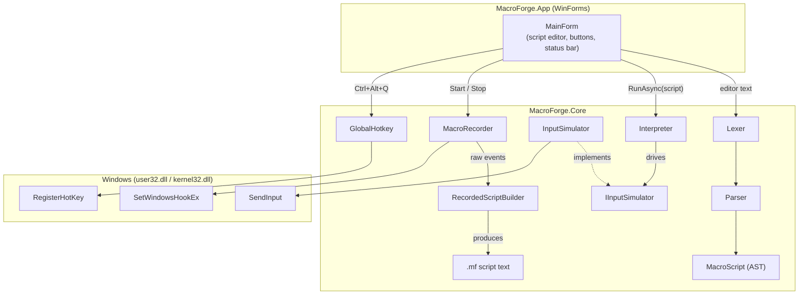
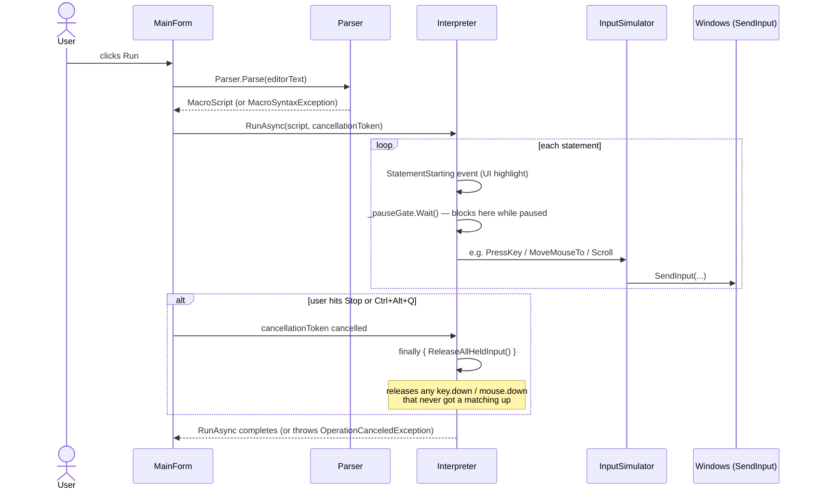
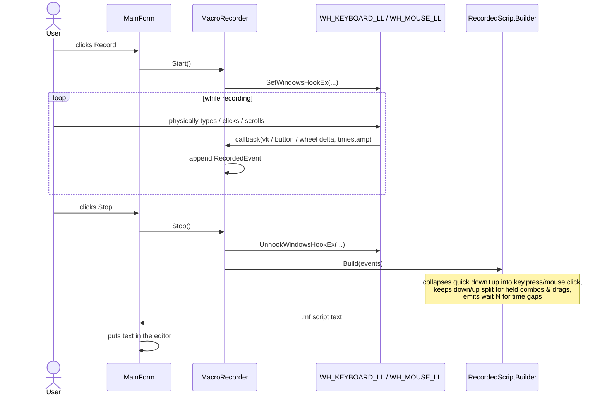

# Architecture

MacroForge is split into two projects on purpose: **MacroForge.Core** (pure logic — language,
interpreter, recording, Win32 interop) has no UI dependency and is fully unit-testable;
**MacroForge.App** is a thin WinForms shell that wires buttons/menus to `Core`. If a UI were
ever added for another platform (e.g. a CLI runner), only `App` would need to change.

```
MacroForge.sln
├── src/MacroForge.Core/     — language, interpreter, recording, Win32 interop (net9.0-windows,
│                               no WinForms dependency; portable in principle to any .NET UI)
│   ├── Language/            — Lexer → Parser → AST
│   ├── Native/              — InputSimulator, VirtualKeyMap, NativeMethods (P/Invoke), GlobalHotkey
│   ├── Recording/           — MacroRecorder (Win32 hooks) + RecordedScriptBuilder (pure logic)
│   └── Interpreter.cs       — walks the AST, drives an IInputSimulator
├── src/MacroForge.App/      — WinForms UI: MainForm, Program (entry point)
├── tests/                   — xUnit tests against MacroForge.Core only
└── benchmarks/              — BenchmarkDotNet project (see docs/BENCHMARKS.md)
```

## Component overview



`IInputSimulator` is the one seam that makes `Interpreter` unit-testable: tests inject a fake
that just records calls (`FakeInputSimulator` in the test project) instead of the real
`InputSimulator`, which would otherwise require a live Windows desktop session and would move
the real mouse/keyboard during `dotnet test`.

## Script execution flow



## Recording flow



## Why the language interpreter walks the AST directly

MacroForge scripts are short-lived, I/O-bound (mostly `wait`s and OS calls, not computation), and
typically run once per invocation. A tree-walking interpreter is the right trade-off: it's simple,
easy to test statement-by-statement, and the AST-walk overhead is negligible next to the
millisecond-scale `wait`s and `SendInput` round-trips it drives (see
[Benchmarks](BENCHMARKS.md) for the actual dispatch-overhead numbers). Compiling to bytecode or
expression trees would add real complexity for no measurable benefit at this scale — see
[Roadmap](ROADMAP.md) for when that calculus might change (e.g. if `for`/`if` with expressions are
added and scripts start doing real computation).

## Safety-relevant design decisions

- **`IInputSimulator` tracks nothing; `Interpreter` tracks held state.** Held-key/button cleanup
  lives in `Interpreter` (`_heldKeys` / `_heldMouseButtons`), not in `InputSimulator`, because the
  interpreter is what knows when a run is stopped/cancelled/thrown out of. This keeps
  `InputSimulator` a dumb, stateless wrapper over `SendInput` — easy to reason about and to fake
  in tests.
- **The panic hotkey is process-global, not window-focused.** `RegisterHotKey` delivers WM_HOTKEY
  to the registering window regardless of focus, which is the whole point: a script that has
  alt-tabbed away or grabbed the mouse must not be able to make itself un-stoppable.
- **`RecordedScriptBuilder` has zero Win32 dependency.** It's a pure function
  `IReadOnlyList<RecordedEvent> → string`, deliberately separated from `MacroRecorder`'s hook
  plumbing so the (fairly intricate) collapse/drag/combo logic can be unit tested with hand-built
  event lists instead of requiring a live recording session.
